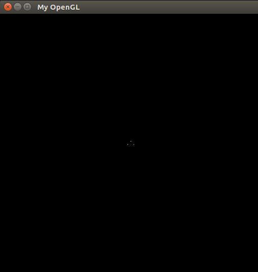
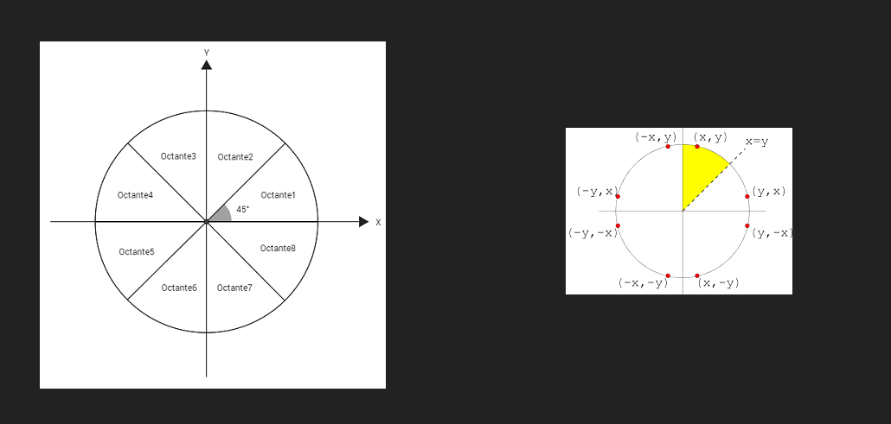
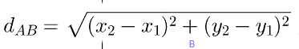
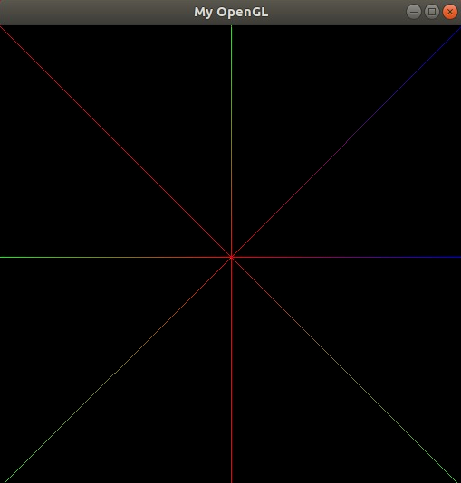
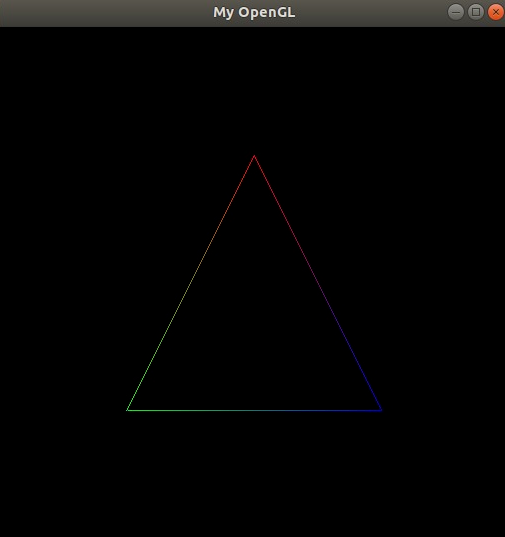

# Atividade 2 Introducao a CG - Rasterization

O objetivo do trabalho é implementar o Algoritmo do Ponto Medio. Sabendo que os monitores tem uma matriz de pixel (quase sempre localizada no canta superior esquerdo) e que cada pixel possui 4 bytes (1 para cores vermelhas, 1 para cores verdes, 1 para cores azuis, 1 para opacidade).

Para alcançar o objetivo iremos implementar 3 funcoes, sao elas passadas pelo professor:

* PutPixel()
* DrawLine()
* DrawTriangle()

Sabendo que W é a largura do monitor, utilizaremos a formula **`4*X + 4*Y*W`** (dada no slide das aulas) para obter o primeiro byte de um certo pixel

## PutPixel

Como feito na Prova I, sera implementado a função PutPixel. Nessa função recebe como parâmetros as coordenadas do ponto (x, y), 
como tambem sua cor, RGBA.

Para descobrir em que posição na memoria gravar, usa-se a fórmula citada acima

```C

void putPixel(pixel_t pixel) {
    int pos = pixel.x * 4 + pixel.y * IMAGE_WIDTH * 4;
    
    fb_ptr[pos++] = pixel.color.r;
    fb_ptr[pos++] = pixel.color.g;
    fb_ptr[pos++] = pixel.color.b;
    fb_ptr[pos]   = pixel.color.a;
}
```

<p align="center">
  
</p>


## Função DrawLine

Para a rasterização de linha foi utilizado o algoritmo de Bresenham, dois pixels como parâmetros. Porem, esse algoritmo ele funciona apenas para retas no primeiro octante, ou seja, retas entre 0º e 45º, assim necessitando alterar o algoritmo.


Primeiro passo foi identificar se os valores de x e y que compõem a reta crescem ou decrescem, no caso uma função inc() para retornar os valores.

<p align="center">
  
</p>

```C
int inc(int a) {
    int x;
    
    if(!a) 
        x = 0;
    else if(a < 0) 
        x = -1;
    else if(a > 0)
        x = 1;
    
    return x;
}
    
int incX = inc(b.x - a.x),
    incY = inc(b.y - a.y);
```


Na interpolação de cores é feito uma comparação de duas distâncias assim indicando o quao proximo o pixel esta do pixel final. A medida  que o pixel se aproxima do pixel final, a cor ira se alterando conforme a aproximação.

Usando a formula de calcular a distância entre dois pontos no espaço, dada por meio de suas coordernadas.

<p align="center">
  
</p>


```C
double dist(pixel_t a, pixel_t b) {
    return sqrt(pow(b.x-a.x, 2) + pow(b.y-a.y, 2));
}
```

A interpolação das cores acontece na função **interpolate()**:

```C
color_t interpolate(pixel_t iP, pixel_t mP, pixel_t fP) {
    double p = dist(mP, fP)/dist(iP, fP);
    
    color_t newColor = {p*iP.color.r + (1-p)*fP.color.r,
                        p*iP.color.g + (1-p)*fP.color.g,
                        p*iP.color.b + (1-p)*fP.color.b,
                        p*iP.color.a + (1-p)*fP.color.a};
    
    return newColor;
}
```
* iP - Pixel Inicial
* mP - Pixel Atual
* fP - Pixen Final

Para gerar a cor do pixel atual, é realizado o cálculo: **`p*iP.color + (1-p)*fP.color`**, onde p é calculado a partir da distância entre mP e fP e dividindo entre a distância iP e fP, assim formando um efeito degrade nas linhas.


<p align="center">
  
</p>


## Função DrawTriangule

Essa função tem como objetivo desenhar o triângulo recebendo como parametro 3 pixels, bastando chamar a função **drawLine()** três vezes. (Fazendo com que as linhas se encontrem nos vértices respectivos)

```C
void drawTriangle(pixel_t p1, pixel_t p2, pixel_t p3) {
    drawLine(p1, p2);
    drawLine(p2, p3);
    drawLine(p3, p1);
}
```

<p align="center">
  
</p>

## Bibliografia

- https://pt.wikipedia.org/wiki/Algoritmo_de_Bresenham
- https://www.pucsp.br/~jarakaki/cgpi/Algoritmos_reta_circulo.pdf
- Slides do professor Christian

