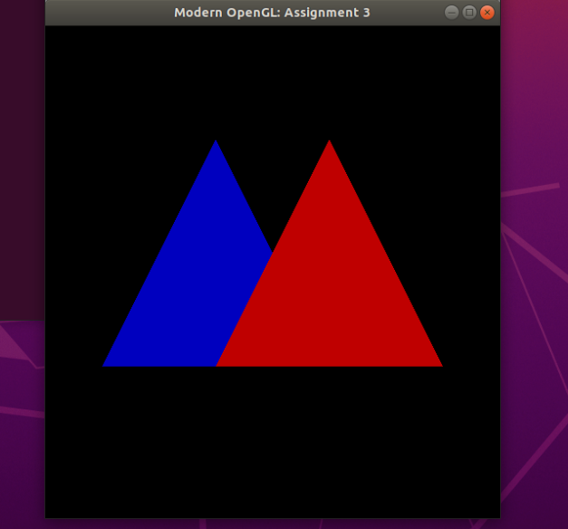
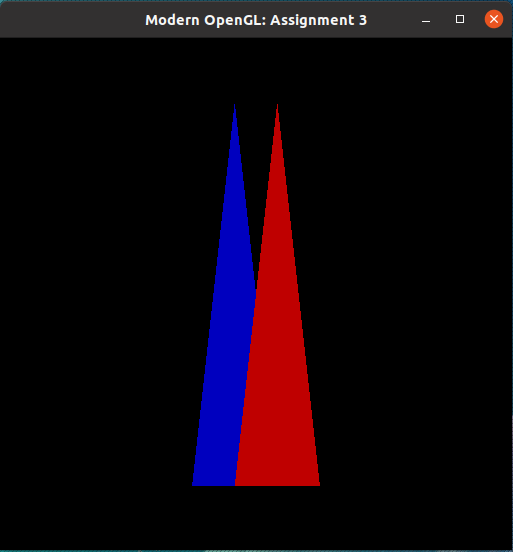
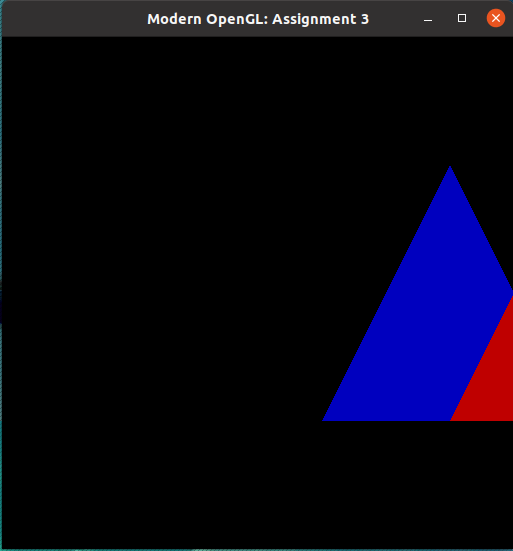
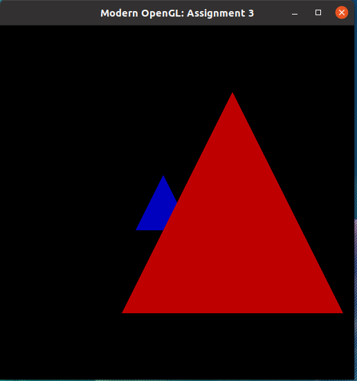
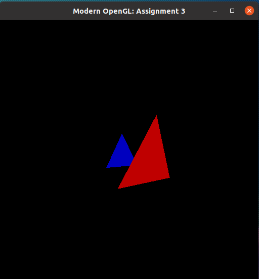
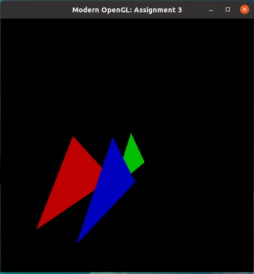

# icg

## Atividade 3 Int CG - Transformations

Foi utilizada a biblioteca GLM no código template.

Compilando o código template, temos:

<p align="center">
  
</p>

## Primera atividade - Escala

Modificar a matriz Model utilizandos os fatores (x, y, z) = (1/3, 3/2, 1)

```C
float scale_array[16] = {1.0f/3.0f, 0.0f, 0.0f, 0.0f,
                              0.0f, 1.5f, 0.0f, 0.0f,
                              0.0f, 0.0f, 1.0f, 0.0f,
                              0.0f, 0.0f, 0.0f, 1.0f};

glm::mat4 model_mat = glm::make_mat4(scale_array);
```
Igualando a matriz Model à matriz de Escala, temos

<p align="center">
  
</p>


## Segunda atividade - Translação

Os fatores para aplicar a translação sao (x, y, z) = (1, 0, 0)

```C
float trans_array[16] = {1.0f, 0.0f, 0.0f, 0.0f,
                         0.0f, 1.0f, 0.0f, 0.0f,
                         0.0f, 0.0f, 1.0f, 0.0f,
                         1.0f, 0.0f, 0.0f, 1.0f};

glm::mat4 model_mat = glm::make_mat4(trans_array);
```
Igualando a matriz Model à matriz de Translacao, temos

<p align="center">
  
</p>


## Terceira atividade - Projeção

Os fatores para aplicar a projeção é d = 1/8 na matriz de projeção

```C
float proj_array[16] = {1.0f, 0.0f, 0.0f,   0.0f, 
                        0.0f, 1.0f, 0.0f,   0.0f, 
                        0.0f, 0.0f, 1.0f,  -8.0f, 
                        0.0f, 0.0f, 0.125f, 0.0f};

glm::mat4 proj_mat = glm::make_mat4(proj_array);
```
Igualando a matriz de Projeção, temos

<p align="center">
  
</p>

## Quarta atividade - Camera

Foram definidos os parametros da camera:

* Posicao da camera  (-0.1, 0.1,  0.1)
* Posicao do Look_At ( 0.0, 0.0, -1.0)

```C
float look_at_array[3] = { 0.0f, 0.0f, -1.0f},
      camPos_array[3]  = {-0.1f, 0.1f,  0.1f},
      camUp_array[3]   = { 0.0f, 1.0f,  0.0f};

glm::vec3 Look_At = glm::make_vec3(look_at_array);
glm::vec3 camPos  = glm::make_vec3(camPos_array);
glm::vec3 camUp   = glm::make_vec3(camUp_array);

```

Para obter o sistema da camera, utilizamos:

* **`Zc = (camPos - LookAt)/||camPos - LookAt||`**
* **`Xc = (Up x Zc)/||Up x Zc||`**
* **`Yc = (Zc x Xc)`**

```C

glm::vec3 camZ = glm::make_vec3(glm::normalize(camPos - Look_At));
glm::vec3 camX = glm::make_vec3(glm::normalize(glm::cross(camUp, camZ)));
glm::vec3 camY = glm::make_vec3(glm::cross(camZ, camX));

```
E em seguida, calculamos Bt e a T e realizando a multiplicacao:

```C
float Bt_array[16] = {camX.x, camY.x, camZ.x, 0.0f,
             	       camX.y, camY.y, camZ.y, 0.0f,
              	       camX.z, camY.z, camZ.z, 0.0f,
            	         0.0f,   0.0f,   0.0f, 1.0f};

float T_array[16] = {1.0f,      0.0f,      0.0f, 0.0f,
	             0.0f, 	 1.0f,      0.0f, 0.0f,
	             0.0f, 	 0.0f,      1.0f, 0.0f,
	            -camPos.x, -camPos.y, -camPos.z, 1.0f}; 
	            
glm::mat4 view_mat = glm::make_mat4(Bt_array) * glm::make_mat4(T_array) * glm::make_mat4(view_array);
```

Assim obtendo:

<p align="center">
  
</p>


## Quinta atividade - Transformação Livre

De inicio foi inserido um novo triangulo, um triangulo bonito na cor **verde** apos os ja existentes no codigo.

```C
float vertices[] = {               .
                                   .
                                   .
                                   
                     0.25f, -0.5f, -0.25f, 0.0f, 0.75f, 0.0f, // green triangle (middle)
                     0.75f,  0.5f, -0.25f, 0.0f, 0.75f, 0.0f,
                     1.50f, -0.5f, -0.25f, 0.0f, 0.75f, 0.0f}; 
  
```
Para ser possivel a rasterizacao do triangulo, foi necessario alterar a linha `glDrawArrays(GL_TRIANGLES, 0, 6);` para `glDrawArrays(GL_TRIANGLES, 0, 3*3);` (3 triangulos com 3 vertices). Tambem foram aplicadas as transformacoes:

* Escala            (0.5, 0.5, 1.5)
* Translacao        (0.1, 0.2, 0.3)
* Rotacao de 60° no eixo Y

```C
float l_scala_array[16] = {1/2.0f, 0.0f, 0.0f, 0.0f,
                           0.0f, 0.5f, 0.0f, 0.0f,
                           0.0f, 0.0f, 1.5f, 0.0f,
                           0.0f, 0.0f, 0.0f, 1.0f};

float l_trans_array[16] = {1.0f, 0.0f, 0.0f, 0.0f,
                           0.0f, 1.0f, 0.0f, 0.0f,
                           0.0f, 0.0f, 1.0f, 0.0f,
                           0.1f, 0.2f, 0.3f, 1.0f};

float yangle = glm::pi<float>()/3;
float l_roty_array[16] = {glm::cos(yangle), 0.0f, -glm::sin(yangle), 0.0f,
			               0.0f, 1.0f,              0.0f, 0.0f,
			  -glm::sin(yangle), 0.0f,  glm::cos(yangle), 0.0f,
				       0.0f, 0.0f,   	         0.0f, 1.0f};
```

Como solicitado na atividade, foi alterado a posicao e o Look_At da camera:

* Posicao (0.4, 0.5,  0.2)
* Look_At (0.1, 0.1, -1.2)

Usando d = 0.5, como fator de projecao, obtemos:

<p align="center">
  
</p>


